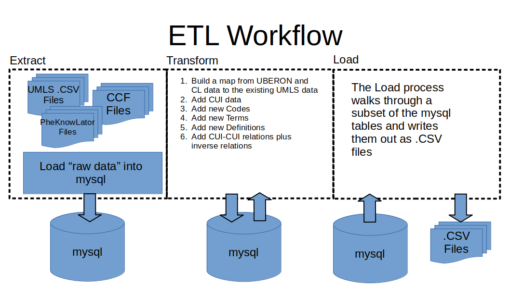
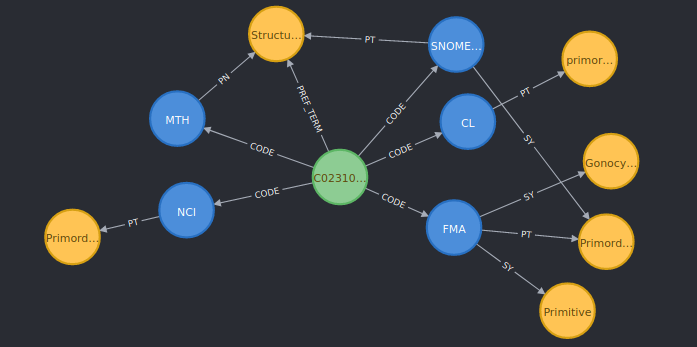
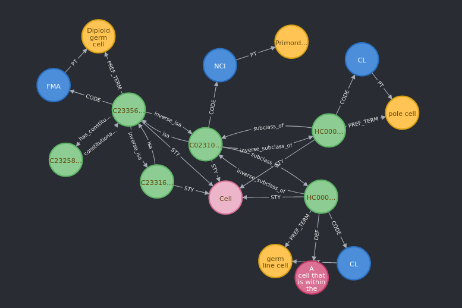

# HuBMAP Knowledge Graph Transform Process

### Intro
The HuBMAP Knowledge Graph Transform process basically consists of an Extract-Transform-Load (ETL) process.  The code is a combination of python code backed by a mysql backend.  Before the ETL process can run several files must be created and staged for this code to use:
1) UMLS .CSV files
2) PheKnowLator files
3) CCF files
 
At the heart of the Knowledge Graph is the **UMLS data**.  This data is exported from Oracle tables using a series of SQL queries that generate a set of .CSV files.  The SQL export code can be found at: https://github.com/dbmi-pitt/UMLS-Graph/blob/master/CSV-Extracts.md.  The SQL exports the data in a format that is compatiable with the "neo4j-admin import" tool (file format details here: https://neo4j.com/developer/desktop-csv-import/).  The data in these files forms the basis for the rest of the Transform process.  All other files and data sources are "layered" on top of the UMLS layer.

The **PheKnowLator files** (https://github.com/callahantiff/PheKnowLator) contain an export of data connecting several bioinformatics ontology datasources together using their xref information.  The xrefs allow one concept in one ontology to map to another concept in a separate ontology (ex: a gene in one ontology maps directly to the same gene in a separate ontology).  The PheKnowLator files also contain relationships between concepts such as anatomic_regionA "is part of" anatomic_regionB, geneA "regulates" geneB, etc.  Currently, PheKnowLator is used to provide two ontologies as layers on top of the UMLS data.  These layers are: UBERON and Cell Ontology (CL).  The Transform process uses xrefs in PheKnowLator to connect UBERON and CL concepts to UMLS data.  For example, http://purl.obolibrary.org/obo/UBERON_0011846 has an xref of "fma:59657".  The Transform code takes all the PheKnowLator data associated with http://purl.obolibrary.org/obo/UBERON_0011846 and builds the new graph nodes and relationships for this data.

Currently, the only other data source is the **CCF files**.  The CCF files reference UBERON codes.  This means the UBERON data (loaded from PheKnowLator) must be loaded before the CCF data can be loaded.  Please note, the CCF files consist of a single .OWL file.  This file is converted to an N-triples file using the RDFConvert code: https://sourceforge.net/projects/rdfconvert/.  RDFConvert is not a requirement, you just need some code that can convert from RDF/XML to N-triples. 

### Workflow
The workflow is illustrated below:

#### Extract Code
The **Extract Code** reads in the data from the source files and preserves them as much as possible.  The code does change the column names from the .CSV files (where the columns contain colons or spaces) and is does exclude Japanese characters.  The **extract(config)** method runs the Extract step.  This method uses several other methods with the following abbreviations: 
* load_umls_XXX: loads one of the UMLS related tables
* load_pkl_XXX: loads one of the PheKnowLator related tables
* load_CCF_XXX: loads on of the CCF related tables

The methods called by the **extract(config)** are summarized below:
###### create_database
The **create_database** method creates all the tables required to load the data in the **Extract** step.  The method references a .sql file to create the tables.
###### load_pkl_node_metadata
This method loads the PheKnowLator metadata file.  This file contains some Japanese characters separated from the English words via a pipe (|).  This method handles these characters and loaded the data into the **pkl_node_metadata** table.
###### load_pkl_relations
The **load_pkl_relations** method loads the PheKnowLator relation data.  This method also adds the inverse relationships to the original PheKnowLator relations.
###### load_pkl_edge_list
This method loads the PheKnowLator edge_list and sets the SAB column for the table to UBERON or CL depending on the data source.
###### load_ccf_nodes_and_edges
The **load_ccf_nodes_and_edges** method basically loads an actual RDF/XML or OWL file into the Knowledge Graph.  This code only works against an N-triples file.  This code only loads an abbreviated subset of the data available from the CCF file.
###### build_xref_table
This method constructs a lookup table called **dbxrefs** from the PheKnowLator Ontology DBXRef file.  The PheKnowLator Ontology DBXRef file contains a row with a PheKnowLator identifier (ex: http://purl.obolibrary.org/obo/UBERON_0009767) and a pipe-delimited list of xrefs (ex: fma:65022|ncit:c101528).   This method splits the xrefs column into a list and writes a row for the PheKnowLator identifier and each individual xref.
###### load_umls_XXX
These various methods load the .CSV file straight into a table using the **load_files(config, file_path, table_name)** method.  

#### Transform Code
The **Transform Code** uses the data found in the mysql tables to add the PheKnowLator and CCF data into the UMLS graph structure.  The **Transform Code** initializes to a "clean state" prior to each run. Therefore, the **Transform Code** can be run repeatedly after the **Extract Code** is run.  To understand the **Transform Code** you need to understand the UMLS graph structure.
###### The CUI Diagram

The CUI diagram illustrates the connections between a **CUI** (green), its **Codes** (blue), and the **Terms** (yellow) associated with the **Codes**.  
* CUI- an abstract concept that crosses one or more vocabularies.  The CUI "anchors" the different codes and terms for the same concept found in different vocabularies or ontologies.  
* Code- these nodes contain the vocabulary/ontology's code for a given concept (ex: UBERON 1234, FMA 1234, etc).  
* Term- a Term contains the string representation for a given code (ex: Brain, Proximal end of femur, etc.).  Terms can have several types of connections to a Code like PT (preferred term) and SY (synonym)

In additon to the nodes above, there are two additional nodes **Definition** (red) and **Semantic Type** (pink)
* Definition- this node contains a text defintition for a **CUI**.  The definitions are loaded from the files.
* Semantic Type- this node groups several **CUIs** into broad categories like Cell, Anatomical Structure, etc.  The **Semantic Type** is added after the files are loaded.

The **tranform(config)** method runs the Transform step.  When the **transform(config)** method is run, the UMLS data is already loaded into the correct tables in mysql.  Therefore, the **transform(config)** method is primarily tasked with "layering" the UBERON and CL data (from PheKnowLator) and the CCF data on top of the UMLS base layer.  The methods called by the **transform(config)** are summarized below:
###### build_ambiguous_codes_table
This method constructs a new table called **temp_ambiguous_codes**.  This table contains a list of the PheKnowLator ontology_uris that map to multiple **CUIs**.  At the heart of the **transform(config)** method is the concept of mapping a single ontology_uri PheKnowLator to a single **CUI**.  Typically a single ontology_uri leading to several **CUIs** results in ambiguous relationships when written into the Knowledge Graph (ex: one ontology_uri could map to codes for left hand, right hand, and hand).  To avoid this, we exclude these **CUI** to **Codes** maps.   
###### build_ontology_uri_to_umls_map_table
The **build_ontology_uri_to_umls_map_table** is the central method for the entire **Transform** process.  This method constructs the **ontology_uri_map**.  An example record is shown below:
ONTOLOGY_URI|CUI|CODEID|TYPE|SAB
------------|---|------|----|---
http://purl.obolibrary.org/obo/UBERON_0003692|C0001208|FMA 25898|PT|FMA

This table provides mappings from PheKnowLator ontology_uri to UMLS data.  In the above example, the ontology_uri maps to the FMA code 25898.  The **umls_cui_codes** table provides the mapping from the FMA 25898 **Code** to **CUI** C0001208.  If no map is found in this table for a given ontology_uri, a new **CUI** is minted using the 'HC' prefix (ex: HC003491).

*Future State Notes for* **build_ontology_uri_to_umls_map_table**
As new ontologies/vocabularies are added to the Knowledge Graph, this method will need to be updated to include them.  Currently, this code only maps UBERON and CL ontology_uris from PheKnowLator through the **build_xref_table** method.  PheKnowLator contains many other ontologies that HuBMAP may need in the future.  To add another ontology from PheKnowLator, you just need to modify the SQL select statement in the **build_xref_table** method to ensure the **build_ontology_uri_to_umls_map_table** method will find the new ontology_uri entries.
###### insert_new_cuis
This method adds new **CUIs** plus their **Codes** for PheKnowLator ontology_uris NOT found in the **ontology_uri_map** table.  In this case, we do the following:
1) mint a new **CUI** prefixed with 'HC' for the ontology_uri
2) extract a new **Code** and codeid from the ontology_uri (ex: http://purl.obolibrary.org/obo/UBERON_6001059 becomes code: UBERON and codeid: UBERON 6001059)
3) insert the new **CUI** and **Code** data into the **ontology_uri_map**, **cuis_updated**, **umls_codes**, and **cui_codes_updated** tables.

*Future State Notes for* **insert_new_cuis**
Currently, the only data source capable of adding new **CUIs** is the PheKnowLator data.  The CCF data does not add any new **CUIs** it references UBERON identifiers which are already added as part of the PheKnowLator data.  If a new data source is added that might contribute new **CUIs**, then this code needs to be modified to include these new references.  In theory, you can simply add another SQL SELECT statement to this code and run the current PheKnowLator code first followed by the new SQL SELECT statement. 
###### insert_new_codes
This method adds new **Codes** for ontologies/vocabularies.  This method depends on the **insert_new_cuis** method since it mints new **CUIs**.  some of the **Codes** will need to reference these new **CUIs**.  Currently, this code adds CCF codes since the **insert_new_cuis** method adds UBERON and CL **Codes**.

*Future State Notes for* **insert_new_codes**
The CCF ontology is a bit of an outlier.  It does not introduce any new **CUIs** so this method is the only way to add its **Code** information.  If a future ontology/vocabulary only adds **Code** information then this method will need to be modified to add its **Code** information.  Otherwise, this code might not need to be updated.

###### insert_new_terms
The **insert_new_terms** method loads labels from ontologies/vocabularies into the Knowledge Graph.  **Important note**: on the Neo4j side these labels are called **Term** nodes whereas in UMLS they are called **SUIs**.  This information is useful when reading the code.  A diagram is also useful to understand this code:

In this diagram, the **Code** nodes (blue) connect to one or more **Term** nodes (yellow).  (Remember, a **Term** node is called a **SUI** in UMLS.) By default, the connection between **Code** and **Term** is the 'PT' relation (PT means 'preferred term').  However, the CCF ontology supplies synonomous **Terms**.  These synonymous **Terms** are connected using the 'SY' relation (SY means 'synonym').
The **insert_new_terms** method performs the following:
1) Retrieve all labels from the various ontologies/vocabularies
2) If a given label does not already exist in the data, mint a new **SUI** using the 'HS' prefix
3) Add any newly minted **SUIs** to the **suis_updated** table
4) Add the **Code** and **SUI** data to the **code_suis_updated** table.
5) Add a 'PREF_TERM' relation between a **SUI** and a newly minted **CUI** in the **cui_suis_updated** table.

*Future State Notes for* **insert_new_terms**
This code will simply need to add the label information for any new vocabulary/ontology.  Currently, the code employs a large UNION SQL query retrieving a superset of the labels.  Breaking this UNION into separate queries and iterating over them is probably better.  Also the manner in which the labels are found in each vocabulary/ontology is highly cusotmized for each vocabulary/ontology.
###### insert_new_defs
This method inserts **Defintion** nodes into the Knowledge Graph.  This code assumes all the **Definitions** are new (there is no check to see if the **Definition** already exists in UMLS).  This code also only applies to the PheKnowLator data at this point.  **Important note:** The Neo4j Knoweldge Graph calls **Defintion** nodes where UMLS call them **ATUIs**.  The **insert_new_defs** code does the following:
1) Mint a new **Definition** identifier with a 'HAT' prefix
2) Insert the new data into **def_updated**, **def_rel_updated**, and **new_def_map**.

*Future State Notes for* **insert_new_des**
This code will simply need to add the definition information for any new vocabulary/ontology.  

###### insert_new_cui_cui_relations
This method extracts all the relationships between **CUIs** in: UBERON, CL, and CCF.  It inserts these relations into the **umls_cui_cuis** table.  In general, it does the following in separate SQL queries:
1) Select two **CUIs** from the same vocabulary (UBERON, CL, or CCF) and return their relationship information
2) Make sure the two **CUIs** are different from one another (don't create self-references)
3) Convert the relationship from its URI identifier to its 'label' and replace any spaces in the label with an underscore
4) Insert this data into the **umls_cui_cuis** table.
5) Repeat the above steps but for the 'inverse relationships'

*Future State Notes for* **insert_new_cui_cui_relations**
This code currently leverages the 'triple' data format (subject,predicate, object) found in most RDF/XML data (plus found in the PheKnowLator edge_list).  In order to load this data for new ontologies it should be fairly simple to convert the ontology RDF/XML into N-triples.  These N-triples would be in the  subject,predicate, object format mentioned above.

#### Load Code
The **Load Code** extracts data from the mysql database and converts it to the .CSV format that is compatiable with the “neo4j-admin import” tool (file format details here: https://neo4j.com/developer/desktop-csv-import/).  The code consists of two methods: **load(config)** and **export_files(config)**.  The **export_files(config)** method walks through a subset of the mysql tables and converts them to a .CSV file:
mysql table|.CSV file
-----------|---------
umls_codes|CODEs.csv
umls_tui_rel|TUIrel.csv
umls_cui_tuis|CUI-TUIs.csv
umls_cui_cuis|CUI-CUIs.csv
cui_codes_updated|CUI-CODEs.csv
code_suis_updated|CODE-SUIs.csv
cui_suis_updated|CUI-SUIs.csv
cuis_updated|CUIs.csv
suis_updated|SUIs.csv
umls_tuis|TUIs.csv
defs_updated|DEFs.csv
def_rel_updated|DEFrel.csv

